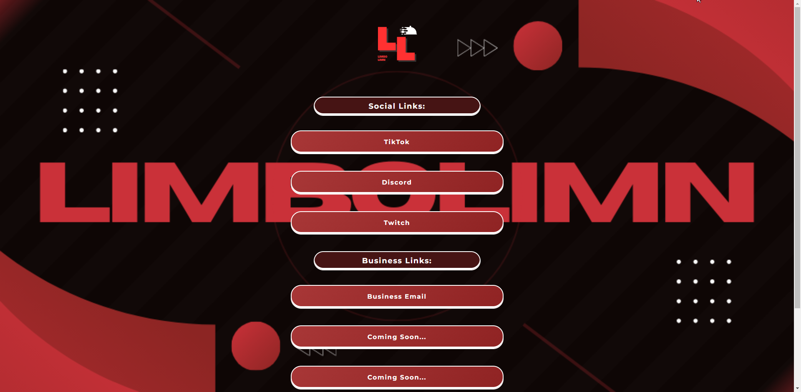

# Streamer Website builder
> This resource allows you to build and deploy a website for yourself or your social links using a very simple GUI.

This resource allows you to build and deploy a website for yourself or your social links using a very simple GUI.



## Installation

1. Clone the repo
   ```sh
   git clone https://github.com/LiamBMX/streamer-website-builder.git
   ```
2. Run the code 
   ```py
   python gui.py
   ```
Or run the gui.bat file

3. Add/Remove/Edit links in the GUI,
4. Save your changed
5. Deploy the code to any website host.

For help dm me on discord @liam0mc

## Usage example

Example uses can be found in the links below:

_My personal website [liamgadams.com](https://liamgadams.com)._
_My friends website made by me w the repo [liambmx.github.io/LilUziTurt/](https://liambmx.github.io/LilUziTurt/)._
_Other friends website made by me w the repo [liambmx.github.io/Shzaltht/](https://liambmx.github.io/Shzaltht/)._


## Release History

* 0.0.1
    * First deployment

## Meta

Discord – [@liam0mc](https://discord.gg/jvsAEa6VsA) 

Distributed under the MIT license. See ``LICENSE`` for more information.

[github.com/LiamBMX/streamer-website-builder](https://github.com/LiamBMX/streamer-website-builder)

## Contributing

1. Fork it (<https://github.com/LiamBMX/streamer-website-builder/fork>)
2. Create your feature branch (`git checkout -b feature/fooBar`)
3. Commit your changes (`git commit -am 'Add some fooBar'`)
4. Push to the branch (`git push origin feature/fooBar`)
5. Create a new Pull Request

## Roadmap

- [x] Add Changelog
- [ ] Add way to change colors
- [ ] Style GUI better
- [ ] Make website for easier use
- [ ] Multi-language Support
- [ ] Add a way to add dividers
- [ ] Way to display email
- [ ] Upload custom icons to buttons
    - [ ] Chinese
    - [ ] Spanish

## Donating 

Cashapp - $liamshuffle